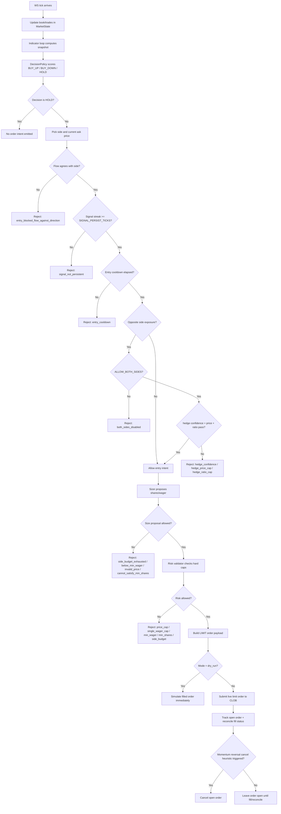

# Copy Pros Trader

High-speed local Python bot for Polymarket directional event markets (BTC/ETH/SOL, 5m and 15m).

This project is built for parallel event execution with strict risk controls, deterministic decision logic, and live observability. It supports:

- Single-event runtime (`run_event_bot.py`)
- Continuous market rotation (`run_continuous_bot.py`)
- Interactive localhost control and monitoring UI (`run_local_playground.py`)

The bot is designed around one question per event: `UP` or `DOWN`. It places **limit orders only**.

## Operating Philosophy

- Canonical philosophy: `docs/OPERATING_PHILOSOPHY.md`
- Convexity-first under distressed pricing (share-aware sizing in reversal setups)
- 95-cent discipline (`0.94` trigger, `0.95` exit) to avoid late expiry flips
- Optimize for payoff quality (expectancy/profit factor), not raw win rate alone

## Runtime Spec

### Supported markets

- `btc15`, `eth15`, `sol15`
- `btc5`, `eth5`, `sol5`

### Modes

- `dry_run`: paper trading; orders are simulated as immediate fills for fast strategy testing.
- `live`: sends real limit orders through Polymarket CLOB using `py-clob-client`.

### Core behavior

- Can join an event at any point and run until that event ends.
- Computes indicators locally from WebSocket order book/trade updates.
- Generates deterministic signals (`BUY_UP`, `BUY_DOWN`, `HOLD`).
- Applies entry gating + risk checks before any order submission.
- Tracks runs, decisions, orders, and runtime events asynchronously to Supabase.
- Emits structured reason codes for entries/exits and run analytics.
- Persists `entry_signal_snapshot` on orders so each filled/submitted position can be traced to exact trigger values.

## Architecture

```text
Polymarket REST (event metadata, winners)
            |
            v
      Event Context
            |
            v
Polymarket WS (book, price_change, last_trade_price)
            |
            v
      MarketState (order books + rolling windows)
            |
            v
     IndicatorEngine (vwap, momentum, imbalance, mid)
            |
            v
     DecisionPolicy (BUY_UP / BUY_DOWN / HOLD)
            |
            v
      EntryPolicy (streak, cooldown, hedge rules)
            |
            v
    Sizer + Risk Validator (price caps, wager caps, shares)
            |
            v
  Execution (limit order submit/reconcile/cancel heuristics)
            |
            v
   Async Supabase writer + CLI/UI telemetry
```

## Polymarket Integration

### REST discovery

`trader/adapters/polymarket/rest_client.py`:

- Resolves event slug from URL or slug text.
- Calls Gamma API to find event + market metadata.
- Calls CLOB market endpoint to fetch condition + token IDs.
- Resolves token IDs for `UP/YES` and `DOWN/NO`.
- Builds start/end timestamps and timeframe (5m or 15m).
- Fetches winning side after event resolution.

### WebSocket stream

`trader/adapters/polymarket/ws_client.py`:

- Endpoint: `wss://ws-subscriptions-clob.polymarket.com/ws/market`
- Subscription message:

```json
{"assets_ids": ["<up_token_id>", "<down_token_id>"], "type": "market"}
```

- Reconnect behavior: infinite loop with retry delay on disconnect/error.
- Payload normalization: accepts object or array, yields dict events.

### Event types consumed

`trader/runtime/orchestrator.py::_ws_ingest_loop` consumes:

- `book`
  - Uses `bids` and `asks` to replace local book snapshot.
- `price_change`
  - Uses `changes` deltas to mutate local book levels.
- `last_trade_price`
  - Uses `price` and `size` to append trade samples for VWAP/flow windows.
  - Classifies aggressor side using top-of-book at ingest time:
    - `+1` if `price >= ask * (1 - TRADE_SIDE_TOLERANCE)`
    - `-1` if `price <= bid * (1 + TRADE_SIDE_TOLERANCE)`
    - `0` otherwise (unknown/inside spread)
  - Current implementation records trade samples from the `UP` token stream.

## Indicators Tracked

Computed in `trader/engine/indicators/__init__.py` from rolling windows in `trader/engine/state.py`.

- `vwap_30s`: volume-weighted trade price over last 30 seconds.
- `vwap_1m`: volume-weighted trade price over last 60 seconds.
- `vwap_5m`: volume-weighted trade price over last 300 seconds.
- `order_imbalance`: `(bid_depth - ask_depth) / (bid_depth + ask_depth)` on UP book.
- `spread_momentum_30s`: relative change in spread versus ~30s lookback.
- `mid_momentum_15s`: relative change in mid price versus ~15s lookback.
- `mid_momentum_30s`: relative change in mid price versus ~30s lookback.
- `mid_momentum_1m`: relative change in mid price versus ~60s lookback.
- `mid_price`: current UP book midpoint.
- `reversal_imminent`: bullish distressed accumulation flag.
- `vwap_delta_15s`: current `vwap_30s` minus value 15s ago.
- `mid_delta_15s`: current `mid_price` minus value 15s ago.
- `momentum_delta_5s`: current `mid_momentum_30s` minus value 5s ago.
- `ew_delta_imbalance`: exponentially weighted signed volume delta ratio in `[-1, 1]`.
- `flow_toxicity`: VPIN-lite rolling toxicity score in `[0, 1]`.
- `large_trade_ratio`: 30s large-volume ratio in `[0, 1]`.
- `unknown_trade_ratio`: 30s unknown-side trade ratio in `[0, 1]`.
- `flow_weight_preset`: active decision weight preset label (`baseline` or `flow_v1`).

Rolling history windows are kept to 300 seconds and pruned continuously.

## Decision Strategy

### Signal scoring

`trader/strategy/decision_policy.py`

Inputs:

- `order_imbalance`
- `mid_momentum_30s`
- `spread_momentum_30s`
- `mid_price` vs `vwap_1m`

Derived:

- `price_vs_vwap = (mid_price - vwap_1m) / vwap_1m`

Weight presets:

- `baseline`: legacy 4-indicator weights (no flow contribution).
- `flow_v1` / `v1` (default): flow-aware weights:
  - `w_mid_momentum=1.4`
  - `w_price_vs_vwap=0.7`
  - `w_order_imbalance=0.6`
  - `w_spread_momentum=0.5`
  - `w_ew_delta=2.2`
  - `w_toxicity=0.6`
  - `w_large_ratio=0.4`

`flow_v1` scoring adds to base directional score:

- directional signed-delta term (`ew_delta_imbalance`)
- toxicity amplifier aligned with delta direction
- large-trade ratio confirmation aligned with delta direction

Unknown-side safeguard:

- If `unknown_trade_ratio > FLOW_UNKNOWN_RATIO_CUTOFF` (default `0.35`), signed delta is scaled by `FLOW_UNKNOWN_DELTA_SCALE` (default `0.5`) before flow scoring.

Time dampening:

- If remaining event time `< 30s`, both scores are multiplied by `0.7`.

Decision thresholds:

- `confidence = clamp(max(up_score, down_score), 0, 1)`
- `edge = clamp(abs(up_score - down_score), 0, 1)`
- `HOLD` when `confidence < MIN_SIGNAL_CONFIDENCE` (default `0.52`)
- `HOLD` when `edge < MIN_SIGNAL_EDGE` (default `0.10`)
- Else choose side by larger score.

Reversal confidence relaxation (additive, bullish-only):

- Effective min confidence becomes `0.40` only when:
  - `reversal_imminent == true`
  - candidate action is `BUY_UP`
  - candidate UP entry price `< 0.25`
- Otherwise confidence floor remains `0.52`.

Entry reason codes:

- `momentum_alignment_entry`
- `bullish_reversal_setup`
- `flow_confirmed_entry` (runtime event when flow materially boosts entry confidence)
- `entry_blocked_flow_against_direction` (runtime event when hard flow gate blocks entry)

### Flow-against-direction hard gate

Before regular entry policy checks, entries are blocked when tape strongly opposes direction:

- Block `BUY_UP` if `ew_delta_imbalance < -FLOW_BLOCK_DELTA_THRESHOLD` (default `-0.10`)
- Block `BUY_DOWN` if `ew_delta_imbalance > +FLOW_BLOCK_DELTA_THRESHOLD` (default `+0.10`)

## Fill vs No-Fill Decision Tree



## Order Placement and Execution

`trader/execution/order_router.py` builds limit payloads:

- `order_type = LIMIT`
- `time_in_force = GTC`
- Rounded precision:
  - price: 4 decimals (floor)
  - shares: 3 decimals (floor)

Execution path (`trader/runtime/orchestrator.py`):

- Entry intents (`ENTRY`) become `BUY_UP` or `BUY_DOWN` limit orders.
- Take-profit intents (`TAKE_PROFIT`) become `SELL_UP` or `SELL_DOWN` limit orders.
- Take-profit reason code is `take_profit_95c_discipline`.
- In `dry_run`, entries and exits are recorded as filled instantly.
- In `live`, open orders are reconciled via `get_order`.
- Cancel heuristic (`trader/execution/cancel_replace.py`):
  - cancel if order age `>= 2s`, `spread_momentum_30s > 0.15`, and `mid_momentum_30s < -0.05`.
- High-price entry blocks emit `entry_blocked_price_too_high`.

## Risk, Limits, and Constraints

All limits are env-driven (`trader/config.py`, `.env.example`).

Default constraints:

- `MAX_ENTRY_PRICE=0.80`
- `MAX_WAGER_PER_SIDE_USDC=20`
- `MAX_SINGLE_WAGER_USDC=5`
- `MIN_WAGER_USDC=2`
- `MIN_SHARES_PER_PURCHASE=5`
- `ALLOW_BOTH_SIDES=true`
- `COUNT_OPEN_ORDERS_IN_EXPOSURE=true`
- `ENABLE_CONVEXITY_BUDGET_RESERVATION=false` (default OFF)
- `ENABLE_FLOW_SIGNALS=true`
- `FLOW_WEIGHT_PRESET=v1`
- `FLOW_BLOCK_DELTA_THRESHOLD=0.10`
- `FLOW_UNKNOWN_RATIO_CUTOFF=0.35`
- `FLOW_UNKNOWN_DELTA_SCALE=0.5`
- `FLOW_EW_HALF_LIFE_SECONDS=15`
- `VPIN_BUCKET_VOLUME=300`
- `VPIN_NUM_BUCKETS=10`
- `LARGE_TRADE_SIZE=75`
- `LARGE_RATIO_WINDOW_SECONDS=30`
- `TRADE_SIDE_TOLERANCE=0.001`

Optional convexity reservation throttle (only when enabled):

- if `entry_price >= 0.60`: cap per-entry wager to `$2`
- if `0.50 <= entry_price < 0.60`: cap per-entry wager to `$4`
- else: no throttle cap (use baseline sizing)
- throttle event logs: `expensive_entry_throttled_to_preserve_convexity_budget`

Take-profit defaults:

- `ENABLE_TAKE_PROFIT=true`
- `TAKE_PROFIT_TRIGGER_PRICE=0.94`
- `TAKE_PROFIT_LIMIT_PRICE=0.95`
- `TAKE_PROFIT_MIN_REMAINING_SEC=120`

Cadence defaults:

- `INDICATOR_INTERVAL_MS=100`
- `SIGNAL_INTERVAL_MS=100`
- `EXECUTION_INTERVAL_MS=75`
- `SUPABASE_FLUSH_INTERVAL_MS=200`
- `ENTRY_WARMUP_MIN_SECONDS=60` (startup gate before first entries)
- `ENTRY_WARMUP_MIN_WS_TICKS=5`
- `ENTRY_WARMUP_MIN_INDICATOR_UPDATES=5`
- `ENABLE_EVENT_DRIVEN_LOOPS=true` (wake indicator/signal/execution loops on new data)
- `EVENT_DRIVEN_MAX_WAIT_MS=250` (fallback max wait to keep housekeeping active)

## Continuous Runner

`trader/runtime/continuous_runner.py`:

- Runs selected market workers in parallel.
- Each worker auto-discovers the current active slug from bucket end time (Polymarket up/down market convention).
- When one event ends, worker advances to the next active event automatically.
- Supports terminal controls:
  - `p` to pause/resume
  - `q` to stop
- Writes final run report JSON to `runtime-logs/`.
- Continuously attempts to resolve pending outcomes and updates rollups.
- Emits wallet-level performance summaries including:
  - realized PnL (total and per market)
  - win rate, average win, average loss, profit factor
  - reason-code grouped entry counts and attributed PnL
  - flow profile at entry (winner vs loser averages for `ew_delta_imbalance` and `flow_toxicity`)
  - count of entries blocked by flow-against-direction gate
  - open orders/open positions and per-side budget usage metrics
  - per-order `entry_signal_snapshot` payload (confidence/edge, core indicators, flow indicators, streak, remaining time, entry price)

## Local Playground (localhost UI)

`trader/playground/app.py`:

- FastAPI control plane + SSE stream.
- Start/Pause/Resume/Stop endpoints.
- Live panels for:
  - Pipeline health (ingest, indicators, decisions, orders per market)
  - Earnings (event outcomes, order feed, resolved PnL totals)
  - Runtime metrics and rollups

Default URL:

- `http://127.0.0.1:8080`

## Supabase Tracking

Asynchronous buffered writer: `trader/adapters/supabase/writer.py`.

Migration: `supabase/migrations/017_bot_tracking_tables.sql`.

Tables used by runtime:

- `copy_pros.bot_runs`
- `copy_pros.bot_decisions`
- `copy_pros.bot_orders`
- `copy_pros.bot_runtime_events`

Notes:

- Writes are non-blocking to trading loops.
- If Supabase is unavailable, rows stay buffered for later flush attempts.

## Quick Start

### Install

```bash
python -m pip install -e .
```

### Configure

```bash
cp .env.example .env
```

Populate `.env` values. Live mode requires full CLOB credentials.

### Run one event

```bash
python scripts/run_event_bot.py --event https://polymarket.com/event/<event-slug> --mode dry_run
```

### Run continuous multi-market session

```bash
python scripts/run_continuous_bot.py \
  --mode dry_run \
  --markets btc15,eth15,sol15,btc5,eth5,sol5 \
  --duration-minutes 60
```

### Run local playground UI

```bash
python scripts/run_local_playground.py
```

## Testing and Verification

```bash
ruff check trader tests scripts/run_event_bot.py scripts/run_continuous_bot.py scripts/run_local_playground.py
mypy trader
pytest -q
```

## Code Map

- Single-event runtime: `trader/runtime/orchestrator.py`
- Continuous runtime: `trader/runtime/continuous_runner.py`
- WebSocket adapter: `trader/adapters/polymarket/ws_client.py`
- REST context/winner adapter: `trader/adapters/polymarket/rest_client.py`
- Live CLOB order client: `trader/adapters/polymarket/trading_client.py`
- Indicators: `trader/engine/indicators/__init__.py`
- Decision policy: `trader/strategy/decision_policy.py`
- Entry gating: `trader/strategy/entry_policy.py`
- Sizing and risk checks: `trader/risk/sizer.py`, `trader/risk/constraints.py`
- Local UI: `trader/playground/app.py`
